## Basic Principles

Visualization may not be as precise as statistics, but it provides a unique view onto data that can make it much easier to discover interesting structures than numerical methods. Visualization also provides the context necessary to make better choices and to be more careful when fitting models. Anscombe’s Quartet is a case in point, showing that four datasets that have identical statistical properties can indeed be very different.

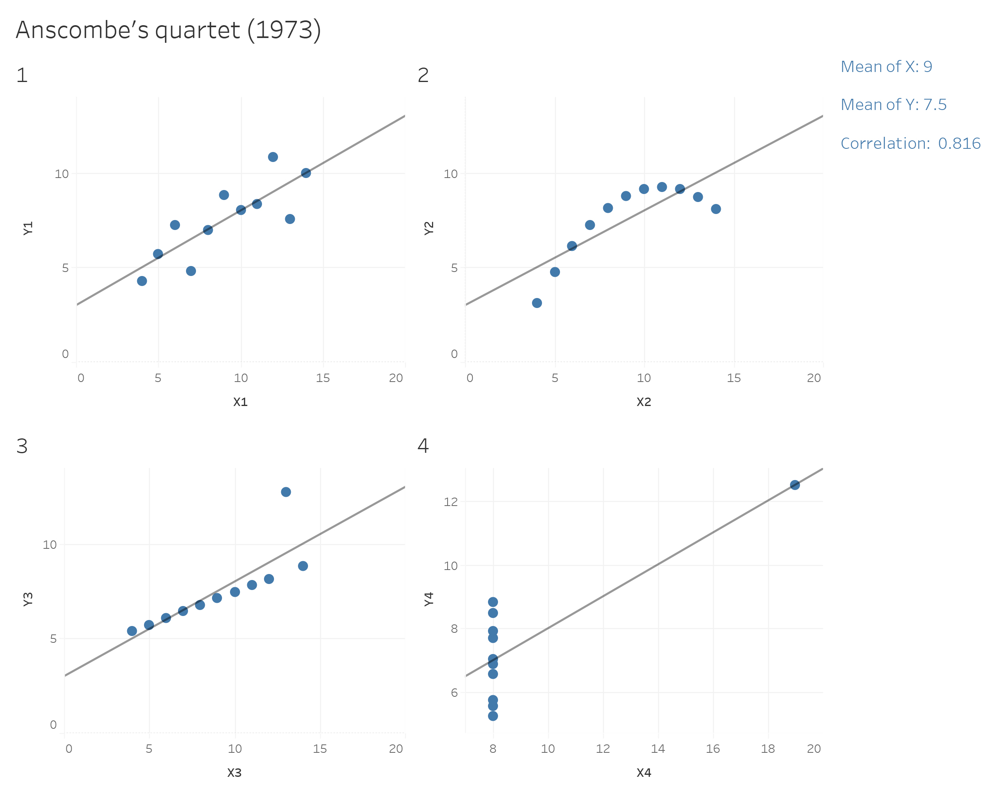

When we visualize data, it means that we are encoding data into visual forms such as colors, size, shape, etc. Although our data pretty much decides which type of graphs we can consider, the human brain cannot decode the information of all types of data visualization equally.

In the mid-1980s, Cleveland and McGill (1985) ran [experiments](http://courses.ischool.berkeley.edu/i247/f05/readings/Cleveland_GraphicalPerception_Science85.pdf) measuring how accurately people were able to perceive the quantitative information encoded by different types of data visualization. People were asked to estimate two values within a chart, or compare values between charts. In 2010, Heer & Bostock (2010) [replicated](https://dl.acm.org/citation.cfm?id=1753357) Cleveland’s earlier experiments and added additional assessments, such as rectangular-area graphs.

The overall pattern of results shows less accurate perception as we move from length-based scales to angles and finally areas.

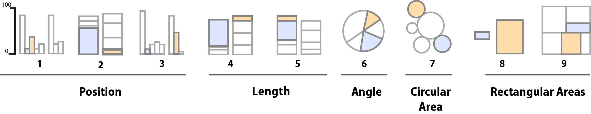

*Schematic representation of basic perceptual tasks for nine chart types, by Heer and Bostock, following Cleveland and McGill. In both studies, participants were asked to make comparisons of highlighted portions of each chart type, and say which was smaller.*

We best judge a quantity if we have a clear scale on which elements are aligned, such as a denoted y-axis for bar charts. When elements are not clearly marked by a scale, comparison is a bit harder but still good. It is more difficult again to compare the lengths of lines without a common baseline.

We tend to misjudge quantities represented as angles. This is why pie charts are usually a bad idea. We also misjudge areas. We have known for a long time that area-based comparisons of quantities are easily misinterpreted or exaggerated. For example, values in the data might be encoded as lengths which are then squared to make the shape on the graph. The result is that the difference in size between the squares or rectangles area will be much larger than the difference between the two numbers they represent.

Finally, three-dimensional visualization of data is hardest to interprete. Our ability to scan the dimension of depth (z-axis) is weaker than our ability to grasp the x and y axes. Three-dimensional visualization can look impressive, but they are also harder to judge.

------------------------------------------------------------------------

## Which chart type should I use?

This is a frequently asked question, and the answer is: There is no best answer. However, you should ask by asking yourself “What would you like to show?”. Below you can see a basic framework to identify different chart types for different data types. Experiment with different charts to see which chart works best to tell the story in your data.

<br>

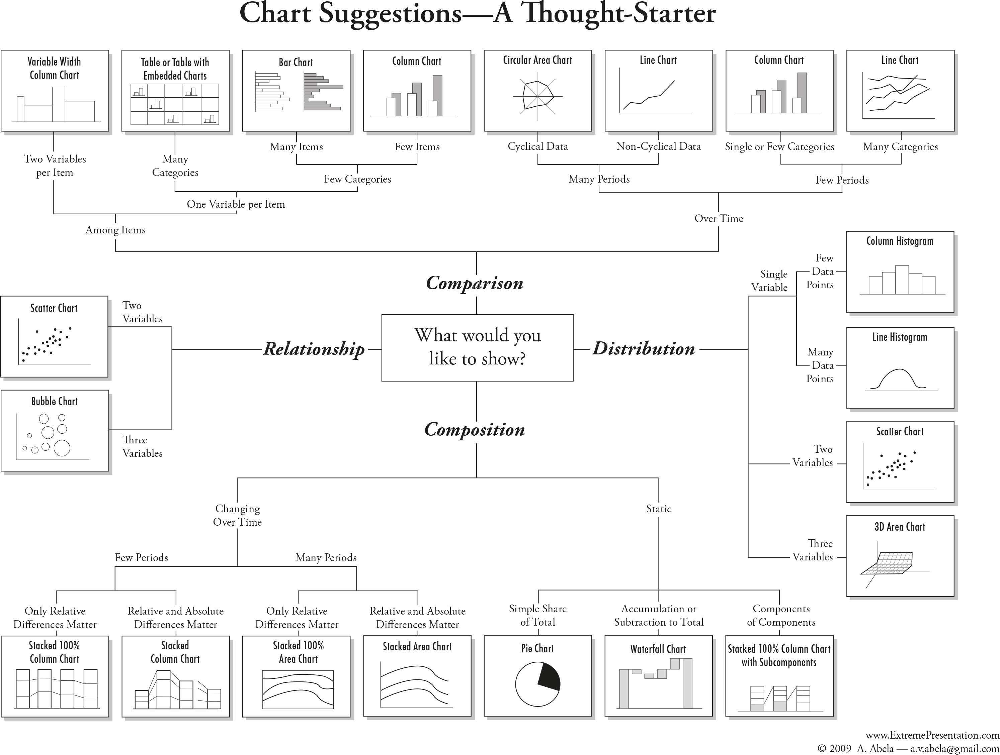

The most important question you should always ask is: "“What is it about the data that I would like to visualize?”. The struggle of a good visualization is often find not a visualization problem, but an operationalization problem.

Information visualization is not an art, but a systematic process. You need to clarify which attributes of your data you want to highlight, and how these attributes relate to other attributes in the data.

*When is data visualization useful?*

The less straight-forward the answer to your question, the more useful data visualization might be. If your question is 'how many toothpastes did our company sell in a given year?', you do not need to visualize the numeric answer to that question. However, if you ask how did our toothpaste sells do compared to other toothpaste companies in a given year, a graphic visualization might be useful to look at the differences and comparisons. Vague questions require you to look at your data from different perspectives and angles. Visualizating your data for vague questions can thus be useful to draw inferences based on your own knowledge.

In most statistic courses for social scientists, creating a graph is part of your statistical analysis. You're being taught to create a graph from your results, to show your effects, or maybe look at the distribution of your data visually.

This ignors that information visualization can be of much greater use than only showing the outcome of an analysis. In fact, the most cited parts of a paper are usually the parts exploring, describing and interpreting the data at hand, which typically requires good and simple visualization. Exploring data visually might then give you indices on how to further work with the data, e.g. statistical analysis, machine learning, network analysis, etc. In other words, information visualization can be vital in the step to a successful operationalization.

*Types of information visualization*

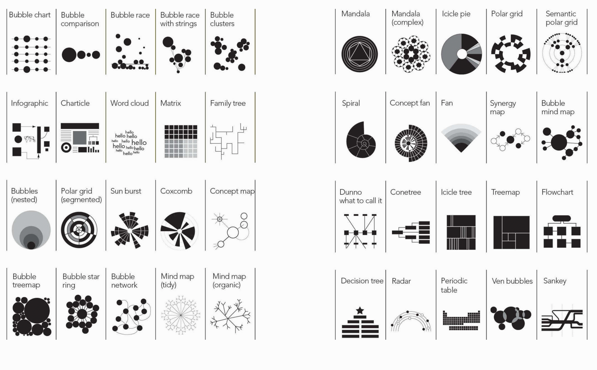

# Examples

The following examples are replicated with Data from the [Gapminder project](https://www.gapminder.org).

Check out Hans Rosling's Ted Talks with beautiful Data Viz:

-   [Population Growth Explained with Ikea Boxes](https://www.gapminder.org/videos/population-growth-explained-with-ikea-boxes/)

-   [Religion and Babies](https://www.gapminder.org/videos/religions-and-babies/)

-   [HIV Facts](https://www.gapminder.org/videos/ted-talk-2009-hans-rosling-hiv-facts/)

Packages needed

```{r, output=F}

library(gapminder)
library(ggplot2)
library(dplyr)

# Focus on one year
gap2007 <- gapminder %>% filter(year == 2007) 
```

### Histogram

Life Expectancy

**Variable**:\
- `lifeExp`: *Life expectancy in 2007*

**Why this plot**:\
A **histogram** is perfect for showing how a continuous variable is distributed. We can quickly see skewness or clusters. Here, it shows how life expectancy is distributed across all countries.

```{r, out.width="65%"}
ggplot(gap2007, aes(x = lifeExp)) +
  geom_histogram(binwidth = 5, fill = "darkred") +  theme_classic()+
  labs(title = "Distribution of Life Expectancy (2007)",
           x = "Life Expectancy") +
  theme(
    axis.text = element_text(size = 14),
    axis.title = element_text(size = 15)
  )
```

### Density Plot

GDP per Capita by Continent

**Variables**:\
- `gdpPercap`: *GDP per capita*\
- `continent`: *Grouping variable*

**Why this plot**:\
Density plots show the shape of a distribution and how it differs between groups. A **density plot** gives a smooth estimate of the distribution of a continuous variable. Better for large datasets than a histogram.

```{r, out.width="65%"}
ggplot(gap2007, aes(x = gdpPercap, fill = continent)) +
  geom_density(alpha = 0.5) +
  scale_x_log10() +theme_minimal()+
  labs(title = "GDP per Capita by Continent (Density Plot)",
       x ="GDP per Capita")+
  theme(
    axis.text = element_text(size = 14),
    axis.title = element_text(size = 15)
  )
```

### Bar Chart

Top 10 Populations

**Variable**:\
- `country` (top 10 by population in 2007)

**Why this plot**:\
Bar charts compare the size of populations clearly across a small number of countries.

```{r, out.width="60%"}
gap2007 %>% 
  arrange(desc(pop)) %>%
  slice(1:10) %>%
  ggplot(aes(x = reorder(country, pop), y = pop)) +
  geom_bar(stat = "identity", fill = "steelblue") +
  coord_flip() +theme_classic()+
  labs(title = "Top 10 Most Populous Countries (2007)", x = "", y = "Population") +
  theme(
    axis.text = element_text(size = 14),
    axis.title = element_text(size = 15)
  )
```

### Boxplot

Life Expectancy by Continent

**Variables**:\
- `lifeExp`: *Life expectancy*\
- `continent`: *Continent grouping*

**Why this plot**:\
A **boxplot** is ideal for comparing distributions between groups and identifying outliers. Boxplots compare central tendency and spread of a continuous variable across groups.

```{r}
ggplot(gap2007, aes(x = continent, y = lifeExp)) +
  geom_boxplot(fill = "skyblue") +theme_minimal()+
  labs(title = "Life Expectancy by Continent", x="", y="Life Expectancy")+
  theme(
    axis.text = element_text(size = 14),
    axis.title = element_text(size = 15)
  )
```

### Violin Plot

Life Expectancy by Continent

**Variables**:\
- `lifeExp`: *Life expectancy*  - `continent`: *Grouping variable*

**Why this plot**:\
A **violin plot** shows the full distribution of a numeric variable across groups. It combines features of a boxplot and a kernel density plot. Useful for understanding distribution shape and spread.

```{r}
ggplot(gap2007, aes(x = continent, y = lifeExp)) +
  geom_violin(fill = "skyblue") +theme_minimal()+
  labs(title = "Life Expectancy by Continent", x="", y="Life Expectancy")+
  theme(
    axis.text = element_text(size = 14),
    axis.title = element_text(size = 15)
  )
```

### Scatter Plot

GDP vs Life Expectancy

**Variables**:\
- `gdpPercap`: *GDP per capita*\
- `lifeExp`: *Life expectancy*

**Why this plot**:\
A **scatter plot** is ideal for visualizing the relationship between two continuous variables. Here, we see the relationship between income and health outcomes in each country.

```{r}
ggplot(gap2007, aes(x = gdpPercap, y = lifeExp)) +
  geom_point(alpha = 0.6) +
  scale_x_log10() +  theme_minimal()+
  labs(title = "Life Expectancy by Continent", x="GDP per Capita", y="Life Expectancy")+
  theme(
    axis.text = element_text(size = 14),
    axis.title = element_text(size = 15)
  )
```

### Bubble Chart

**Dataset**: The `gapminder` dataset provides country-level data on GDP per capita, life expectancy, population, and continent from 1952 to 2007.

**Variables**:\
- `gdpPercap`: *GDP per capita* (x-axis, log scale)\
- `lifeExp`: *Life expectancy* (y-axis)\
- `pop`: *Population* (bubble size)\
- `continent`: *Continent* (bubble color)

**Why this plot**:\
This **bubble chart** shows how income and health outcomes vary across continents and populations, similar to the famous Gapminder visuals by Hans Rosling.

```{r}


gap2007 %>%
  ggplot(aes(
    x = gdpPercap,
    y = lifeExp,
    size = pop,
    color = continent
  )) +
  geom_point(alpha = 0.8) +
  scale_x_log10() +
  scale_size(range = c(2, 20), guide = "none") +
  scale_color_viridis_d(option = "D", end=0.95) +
  labs(
    title = "Life Expectancy vs GDP per Capita (2007)",
    subtitle = "Bubble size = population, color = continent",
    x = "GDP per Capita (log scale)",
    y = "Life Expectancy",
    color = "Continent"
  ) +
  theme_minimal() +  theme(
    axis.text = element_text(size = 14),
    axis.title = element_text(size = 15)
  )

```

### Line Plot (Time-Series)

Life Expectancy Over Time

**Variables**:\
- `year`: *Year*\
- `lifeExp`: *Life expectancy*

**Why this plot**:\
A **line plot** is best suited for time series data. It helps show trends.

```{r, out.width="60%"}
gapminder %>% 
  filter(country %in% c("Germany", "India", "China")) %>%
  ggplot(aes(x = year, y = lifeExp, color = country)) +
  geom_line(linewidth = 1.1) +
  scale_color_viridis_d(option = "B", end = 0.85) +
  labs(title = "Life Expectancy Over Time", y="Life Expectancy", x="", colour="Country")+
  theme_classic() + 
  theme(
    axis.text = element_text(size = 14),
    axis.title = element_text(size = 15)
  )
```

### Faceted Plot

Faceted Scatter Plot – by Continent

**Variables**:\
- `gdpPercap`, `lifeExp`\
- Faceted by `continent`

**Why this plot**:\
Faceting creates small multiples for each group. Facets allow side-by-side comparison of patterns within groups.

```{r}
ggplot(gap2007, aes(x = gdpPercap, y = lifeExp)) +
  geom_point(alpha = 0.5) +
  scale_x_log10() +
  facet_wrap(~ continent) +theme_minimal()+
  labs(title = "Life Expectancy vs GDP per Capita by Continent", y="Life Expectancy", x="GDP per Capita")+ 
  theme(
    axis.text = element_text(size = 10),
    axis.title = element_text(size = 13),
    strip.text = element_text(size = 14, face = "bold")
  )
```

### Choropleth

```{r, output=F}
library(sf)
library(rnaturalearth)
library(rnaturalearthdata)
```

Life Expectancy by Country

**Dataset**: `gapminder` (country-level life expectancy, 2007) joined with world map data from `rnaturalearth`.

**Variables**: - `country`: *Country name*\
- `lifeExp`: *Life expectancy (used for color)*\
- `geometry`: *Country boundaries*

**Why this plot**:\
A **choropleth map** visualizes geographic variation. Ideal for showing how life expectancy differs across regions.

```{r}
# Load world map
world <- ne_countries(scale = "medium", returnclass = "sf")

# Join data by country name
map_data <- left_join(world, gap2007, by = c("name" = "country"))

# Plot map
ggplot(map_data) +
  geom_sf(aes(fill = lifeExp), color = "white", size = 0.1) +
  scale_fill_viridis_c(name = "Life Expectancy", na.value = "gray90") +
  labs(title = "Life Expectancy by Country (2007)") +
  theme_minimal()
```

### Heatmap (Tile)

**Dataset**: The `volcano` dataset is a matrix of topographic elevation data for a volcano in New Zealand.

**Variables**:\
- `X`, `Y`: *Grid coordinates*\
- `Z`: *Elevation*

**Why this plot**:\
A **heatmap** displays continuous values across a 2D space using color. Perfect for visualizing elevation or intensity grids.

```{r, out.width="70%"}
volcano_df <- as.data.frame(as.table(volcano))
colnames(volcano_df) <- c("X", "Y", "Z")

ggplot(volcano_df, aes(x = X, y = Y, fill = Z)) +
  geom_tile() +
  scale_fill_viridis_c() +
  labs(title = "Heatmap of Volcano Elevation",
          fill = "Elevation (m)")  +
  theme(
    axis.title = element_blank(),
    axis.text = element_blank(),
    axis.ticks = element_blank()
  )
```

### Arrange Plots

```{r}
# Load package
library(patchwork)

# Filter for key countries
data <- gapminder %>%
  filter(country %in% c("Germany", "India", "China"))

# Plot A: Life expectancy over time
p1 <- ggplot(data, aes(x = year, y = lifeExp, color = country)) +
  geom_line() +   scale_color_viridis_d(option = "B", end = 0.85) +
  labs(title = "Life Expectancy", x = NULL, y = "Years") +
  theme_minimal() + theme(axis.text.x = element_text(angle = 45, hjust = 1))

# Plot B: GDP per capita over time
p2 <- ggplot(data, aes(x = year, y = gdpPercap, color = country)) +
  geom_line() +  scale_color_viridis_d(option = "B", end = 0.85) +
  labs(title = "GDP per Capita", x = NULL, y = "USD") +
  theme_minimal() + theme(axis.text.x = element_text(angle = 45, hjust = 1))

# Plot C: Population over time
p3 <- ggplot(data, aes(x = year, y = pop, color = country)) +
  geom_line() +  scale_color_viridis_d(option = "B", end = 0.85) +
  labs(title = "Population", x = NULL, y = "Population") +
  theme_minimal() + theme(axis.text.x = element_text(angle = 45, hjust = 1))


# Arrange plots in a 2x2 grid with tags
(p1 | p2) /
(p3 | plot_spacer()) +
  plot_annotation(tag_levels = 'A')
```

# Good and Bad Graphs

-   Like good writing, good graphical displays of data communicate ideas with clarity, precision, and efficiency.

-   Like poor writing, bad graphical displays distort or obscure the data, make it harder to understand or compare, or otherwise thwart the communicative effect which the graph should convey.

## Good Figures

Coming across a good visualization in this dense information jungle nowadays is a relief, because it is effortless and just poures in.

After pie charts, double Y-axis graphs have caused more trouble than almost any other

When we look at maps, we tend to focus on the substantive matter of the data and don't primarily think about the methodology behind it.

*Time-Series*

A random sample of 4'000 graphics from 15 popular newspapers and magazins from around the world between 2974 and 1980 showed that 75% of these graphics displayed time-series Tufte (1983). The strength of time-series is the natural ordering of the time scale, and the ability to make big data sets with lots of variability easily visual.

Adding an additional space dimension to time-series (if your data allows) increases explanatory power. The following examples show complex multivariate graphics that are so easy to understand that viewers barely notice the multiple dimensions.

*Narrative Graphics of Time and Space*


*Visual Area and Numerical Measure*

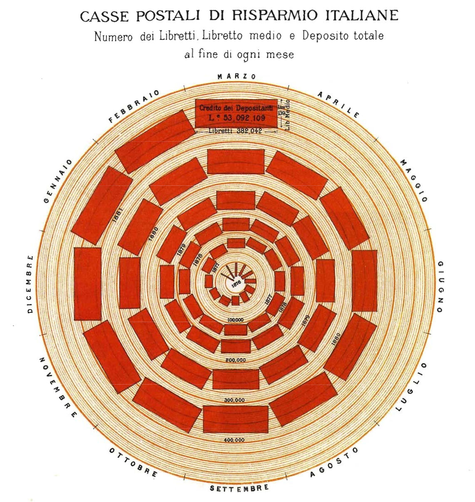{width="70%"}

*Maps*

As the importance of location data continues to grow so do the ways you can visualize this information. Maps are great for an intuitive to look at spatial patterns and great for distributing geographic data. In many cases, just by making a map you are doing analysis. That’s because you’re making the map for a reason. You have a question you want the map to help answer: Where has disease ravaged trees? Which communities are in the path of a wildfire? Where are areas of high crime? It’s also because when you make a map, as with any analysis, you’re making decisions about which information to include and how to present that information. Effective visualization is valuable for communicating results and messages clearly in an engaging way. Here are three key decisions that affect the information a map presents and the story it tells.

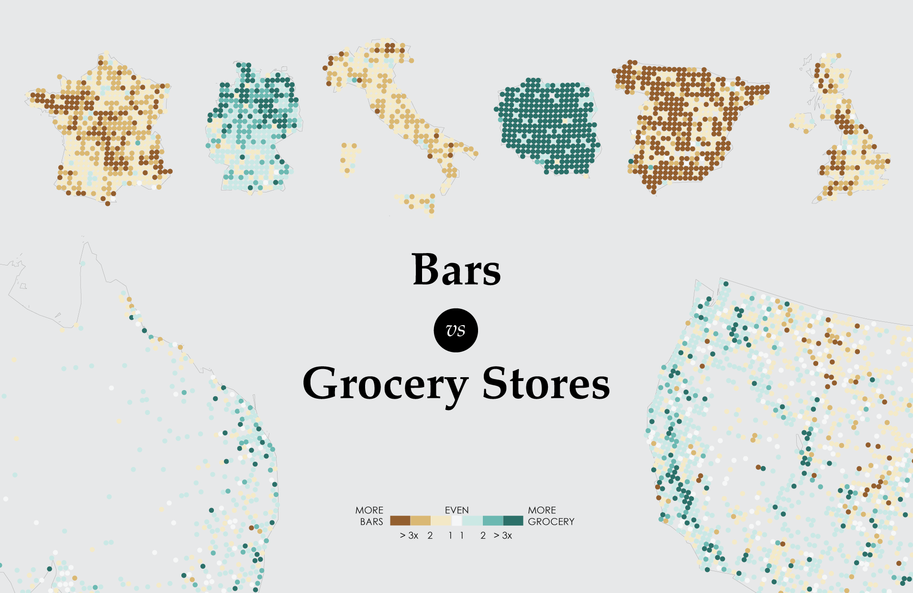

Tyler Vigen wrote an [algorithm](http://tylervigen.com/spurious-correlations) that attempts to automatically find things that correlate.

## Bad Figures

## Pie Charts

::::: columns
::: {.column width="45%"}
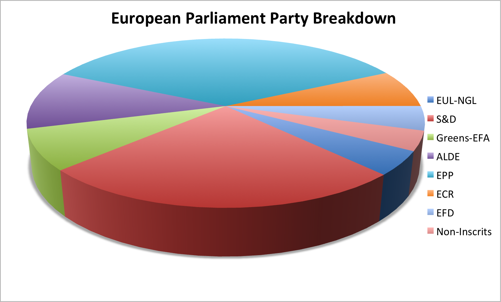

Looking at this chart, S&D appears to be roughly even with EPP.

In 3D Pie Charts, the perspective is distorted, it seems as if red is in fact bigger.
:::

::: {.column width="55%"}
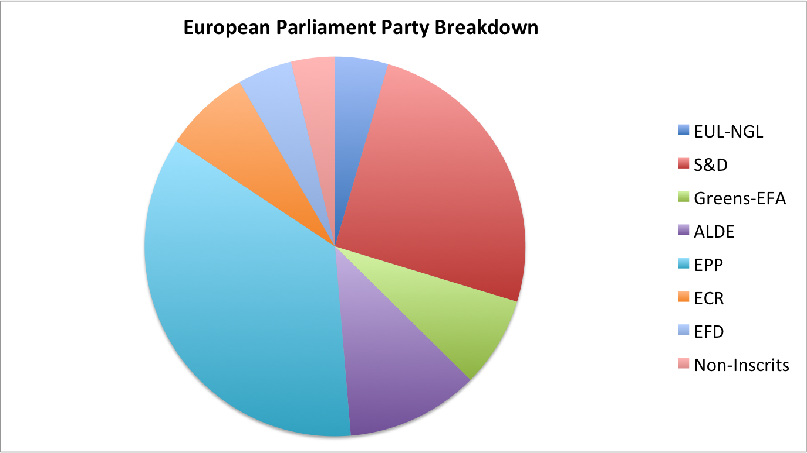

-   Look at the single slices, and see if you can figure out an ordering from largest to smallest?
:::
:::::

**… What?**

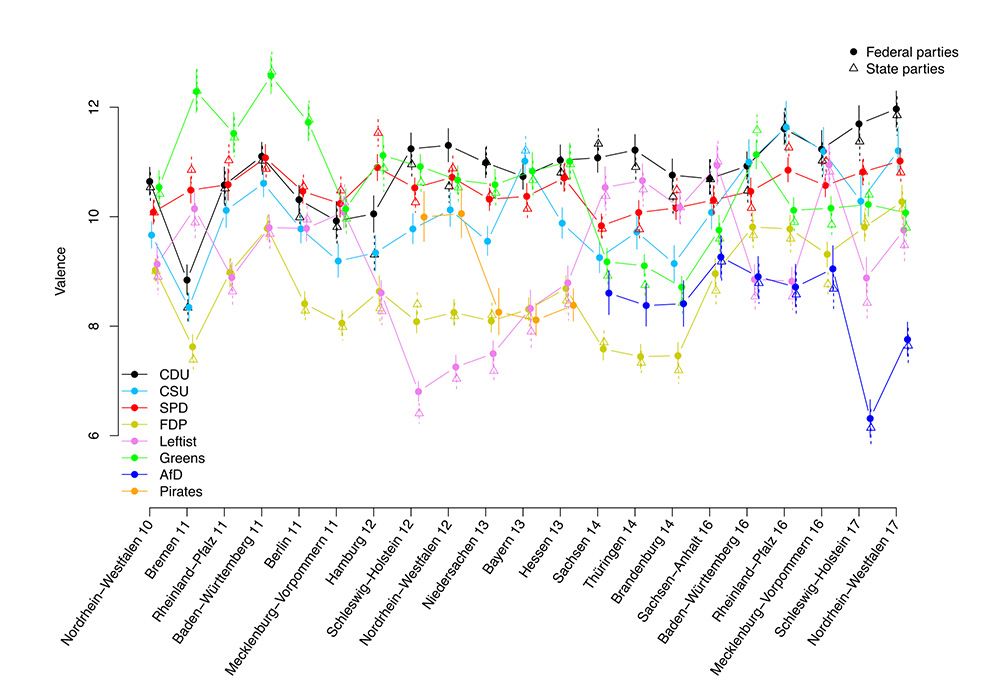{width="80%"}

Too much going on, wrong chart type.

**Context is essential**

Good data visualization should always answer the question 'compared to what?'. Too few data in a graph should always alarm you. Consider the example about traffic deaths in the 'bad figures' section.

**Data-Ink**

Good information visualization should invoke your focus on the substance of the data and nothing else. Statistical graphics are instruments to help people reason about quantitative information. Data-Ink is the non-erasable core of a graphic, the non-redundant ink arranged in response to variation in the numbers represented. That ink changes as the data changes. You should try to maximize the share of data-ink in your graph. Erase non-data-ink within reason.

**Chartjunk**

The decoration of graphs produces a lot of ink that is not necessary to understand the data behind the graph. This non-data-ink is called chartjunk. This can include

-   unintentional optical art (eye-catching visual additions to a graph that distracts from the actual information and distorts the reader)

-   The Grid (Grids are mostly for the intitial plotting of the data, but they carry no information and clutter up the graphic)

-   Self-promoting graphics (when the data measures and elements become the design elements)

::::: columns
::: {.column width="50%"}
```{r}

gap2007 %>%
  arrange(desc(pop)) %>%
  slice(1:10) %>%
  ggplot(aes(x = country, y = pop)) +
  geom_bar(stat = "identity") +
  labs(title = "population of Countries in year 2007") 

```
:::

::: {.column width="50%"}
```{r}

gap2007 %>%
  arrange(desc(pop)) %>%
  slice(1:10) %>%
  ggplot(aes(x = country, y = pop, fill = country)) +
  geom_bar(stat = "identity", color = "black", linewidth = 1.5) +
  labs(title = "population of Countries in year 2007", x = "This is the X Axis", y = "Some Very Large Numbers") 

```
:::
:::::


```{r}
library(tidyverse)
library(scales)

gap2007 %>%
  arrange(desc(pop)) %>%
  slice(1:10) %>%
  mutate(country = forcats::fct_reorder(country, pop)) %>%
  ggplot(aes(x = country, y = pop)) +
  geom_col(fill = "grey30", width = 0.6) +
  coord_flip() +
  scale_y_continuous(labels = label_number(scale = 1e-6, suffix = "M")) +
  labs(
    title = "Population of the 10 Largest Countries (2007)",
    x = NULL,
    y = "Population"
  ) +
  theme_minimal(base_size = 13) +
  theme(
    panel.grid.major.y = element_blank(),
    panel.grid.minor = element_blank(),
    panel.grid.major.x = element_line(color = "grey90"),
    axis.ticks = element_blank(),
    axis.line = element_blank(),
    plot.title = element_text(face = "bold"),
    plot.title.position = "plot"
  )
```


The following example is adapted from Tufte (1983). He shows how data out of context can present untruthful results. When presenting results or effects, you should always show the answer to the question 'compared to what', such as time before/after or other units.

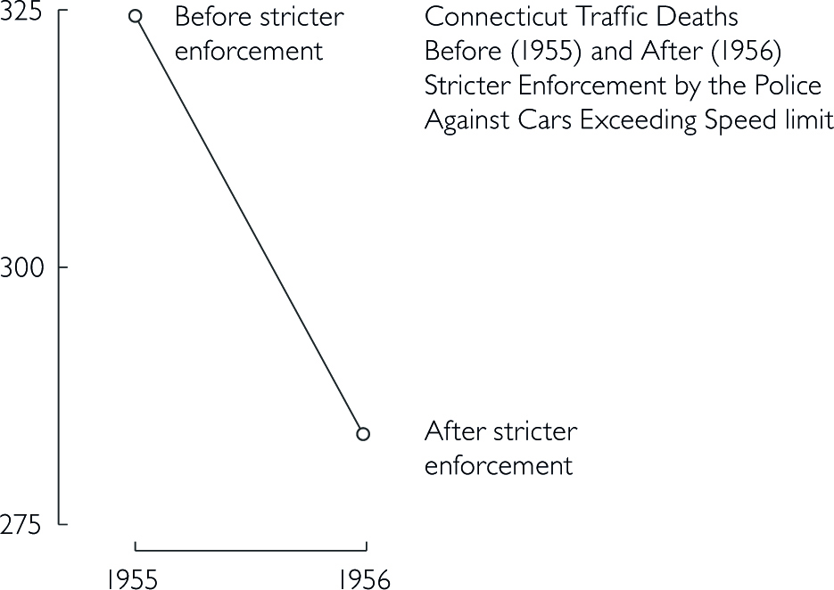{width="60%"}

Design that is too data thin should always raise your suspicion and you should consider the question 'compared to what?'. Here, a few more datapoints lead to a completely different conclusion. In the first figure, one could assume that a stricter enforcement of speed limits lead to a significant decrease in traffic deaths. However, the second figure below shows that there was actually a sudden increase before the law enforcement. Thus, the drop might not be correlated with law enforcement.

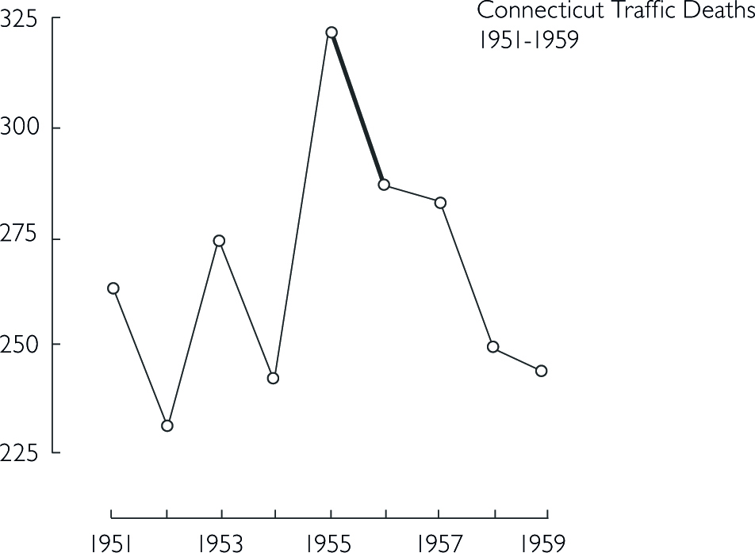{width="60%"}

The line connecting the two datapoints in the first figure could have a variety of other time-paths before and after.

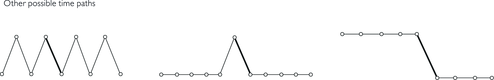

Bringing other states into the picture further reveals that not only Connecticut had a sudden increase in 1955 in traffic deaths.

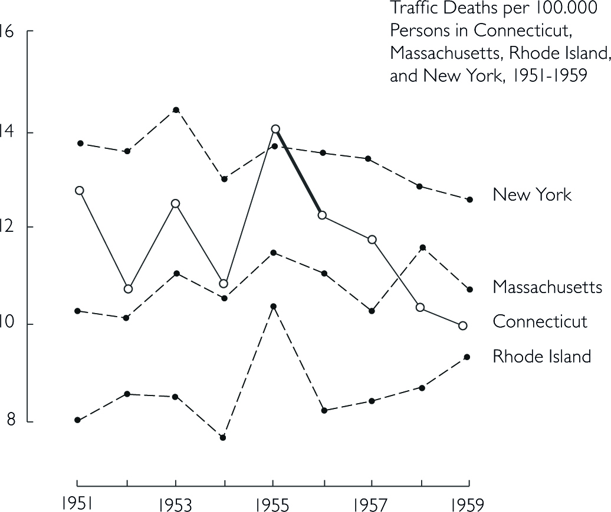{width="60%"}

Think about the responsibility you have towards your reader. Depending on the platform and publication, showing an untruthful chart can lead to a lie being repeated thousands of times. Here are some principles you should consider in order to keep your graphs truthful (Tufte 1983, 77):

1.  The representation of numbers should always be directly proportional to the numerical quantities represented.

2.  Clear labelling should avoid ambiguities in interpreting graphs. In the best case, you write the labelling directly on the graph. Add important event labels.

3.  Show data variation, not design variation.

4.  Graphics shouldn't quote data out of context

5.  The number of dimensions in your graph should never exceed the number of dimensions in your data.

# More Design Examples

For more pre-defined design options, check out the [`ggthemes`](https://github.com/jrnold/ggthemes) package.

```{r, Output=F, message=F}
#remotes::install_github("wilkelab/cowplot")
#remotes::install_github("clauswilke/colorblindr")

library(cowplot)
library(colorblindr)
library(ggthemes)
library(colorspace)

```

::::: columns
::: {.column width="50%"}
The Economist Style

```{r}
ggplot(gap2007, aes(x = gdpPercap, y = lifeExp, color = continent)) +
  geom_point(size = 3, alpha = 0.7) +
  scale_x_log10() +
  scale_color_economist() +
  labs(
    title = "Life Expectancy vs GDP per Capita (2007)",
    x = "GDP per Capita (log scale)",
    y = "Life Expectancy",
    color = "Continent"
  ) +
  theme_economist()
```
:::

::: {.column width="50%"}
Tufte Style

```{r}
ggplot(gap2007, aes(x = continent, y = lifeExp)) +
  geom_boxplot(width = 0.4) +
  labs(
    title = "Life Expectancy by Continent (Tufte Style)",
    x = NULL,
    y = "Life Expectancy"
  ) +
  theme_tufte(base_size = 14)
```
:::
:::::

Below, the graph uses the automatic color assignment from `ggplot2` and creates red and green lines to distinguish the countries.

```{r, out.width="60%"}
gapminder %>% 
  filter(country %in% c("Germany", "India", "China")) %>%
  ggplot(aes(x = year, y = lifeExp, color = country)) +
  geom_line() +
  labs(title = "Life Expectancy Over Time")+theme_minimal()
```

For many colorblind people, this will be difficult to distinguish the lines. Overlaying the graph with different types of colorblindness from the `colorblindr` packages shows that it is difficult or even impossible to distinguish the line colors.

```{r}
base_plot <- gapminder %>%
  filter(country %in% c("Germany", "India", "China")) %>%
  ggplot(aes(x = year, y = lifeExp, color = country)) +
  geom_line(linewidth = 1.2) +
  labs(title = "Life Expectancy Over Time", color = "Country") +
  theme_minimal()


cvd_grid(base_plot)
```

Below, the initial graph from above that uses the viridis colorscale is shown with a colorblind simulation overlay from the `colorblindr` package. The viridis palette is specifically designed to be perceptible to individuals with most forms of color vision deficiency.

```{r}
viridis <- gapminder %>% 
  filter(country %in% c("Germany", "India", "China")) %>%
  ggplot(aes(x = year, y = lifeExp, color = country)) +
  geom_line(linewidth = 1.1) +
  scale_color_viridis_d(option = "B", end = 0.85) +
  labs(title = "Life Expectancy Over Time")+theme_classic()

cvd_grid(viridis)

```

::::: columns
::: {.column width="50%"}
Alternative: No colors but linetypes

```{r}
gapminder %>% 
  filter(country %in% c("Germany", "India", "China")) %>%
  ggplot(aes(x = year, y = lifeExp, linetype = country)) +
  geom_line(linewidth = 1.1) +
  labs(title = "Life Expectancy Over Time", y="Life Expectancy", x="")+theme_classic()+theme(
    axis.text = element_text(size = 14),
    axis.title = element_text(size = 15)
  )
```
:::

::: {.column width="50%"}
For custom linetypes

```{r}
gapminder %>% 
  filter(country %in% c("Germany", "India", "China")) %>%
  ggplot(aes(x = year, y = lifeExp, linetype = country)) +
  geom_line(linewidth = 1.1) + 
    scale_linetype_manual(values = c(
    "Germany" = "solid",
    "India" = "dashed",
    "China" = "dotdash"
  )) +
  labs(title = "Life Expectancy Over Time", y="Life Expectancy", x="")+theme_classic()+
  theme(
    axis.text = element_text(size = 14),
    axis.title = element_text(size = 15)
  )
```
:::
:::::

For more Information on how to adjust `ggplot2` plots, check out the `ggplot2` [`cheat sheet`](https://posit.co/wp-content/uploads/2022/10/data-visualization-1.pdf)

## Tables

Tables are usually better than graphics for 20 or less numbers. The special power of graphics comes with large datasets. Tables also work well when the data presentation requires many localized comparisons.

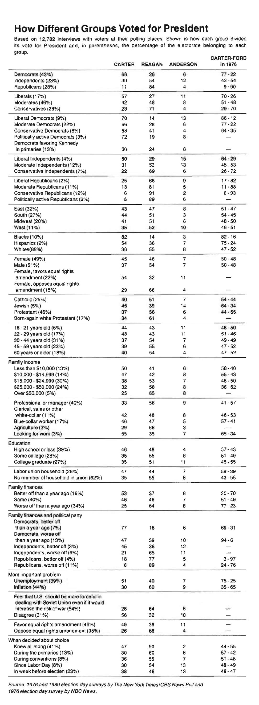{width="65%"}

Tables are often presented with rows/cols ordered alphabetically which is good for looking up specific values, but it is bad for seeing patterns, trends, anomalies. It is better to sort rows or columns by means or medians and to shade cells according to values. If you are going to present the numbers, round a lot. Nobody wants to see all those decimals.

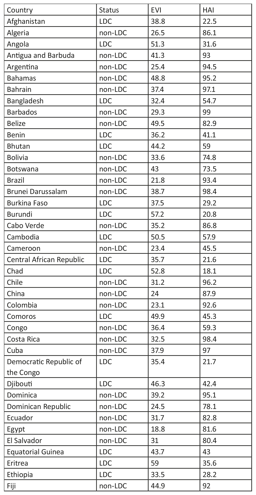{width="60%"}

::::: columns
::: {.column width="50%"}
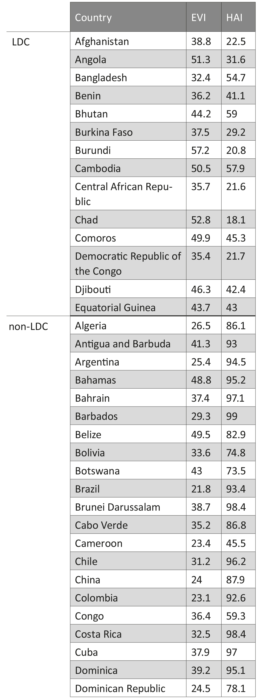{width="70%"}
:::

::: {.column width="50%"}
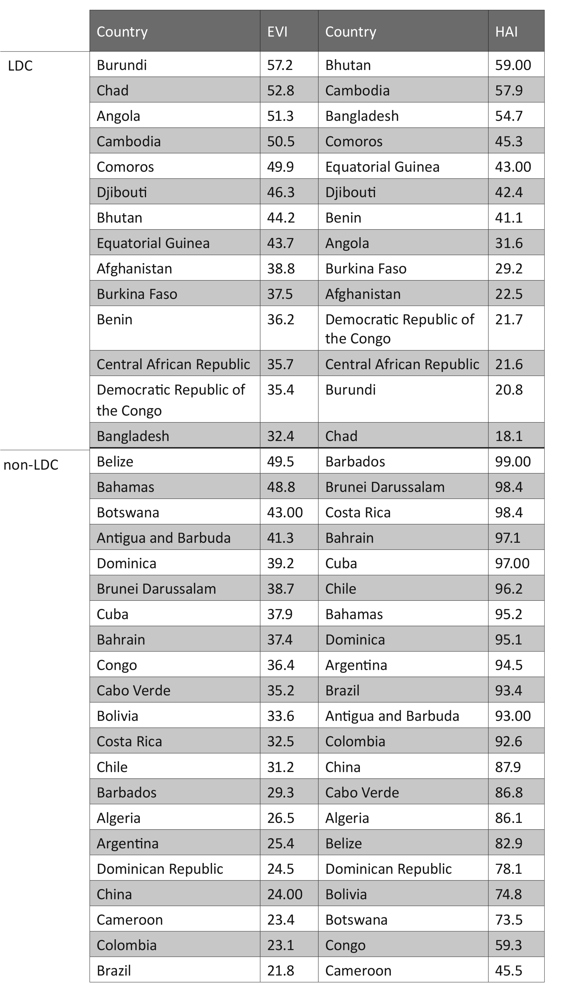
:::
:::::

## Inspirational Resources

-   [The Fallen of World War II](https://vimeo.com/128373915)

-   [UN Icons](https://thenounproject.com/ochavisual/collection/ocha-humanitarian-icons-v02/)

-   [Flowing Data](https://flowingdata.com/)

-   [Country Clusters](https://projects.interacta.io/country-tsne/)

-   [Tufte in R](http://motioninsocial.com/tufte)

-   [Sarah Leo, a visual journalist at The Economist, looked through the archives and found some charts that could use a re-design.](https://medium.economist.com/mistakes-weve-drawn-a-few-8cdd8a42d368)

-   [Gapminder project](https://www.gapminder.org)
